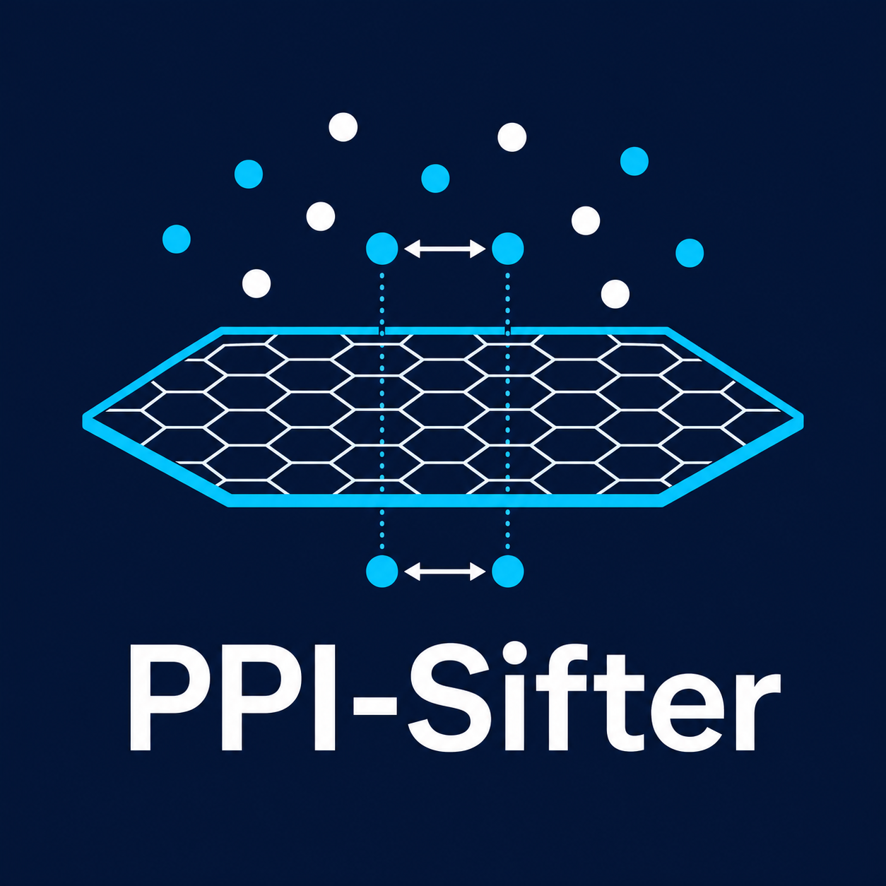
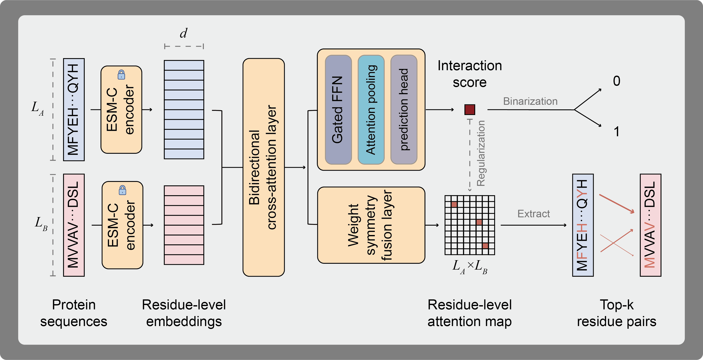

<p align="center">
  
  <span>
    <strong style="font-size:1.6em;">PPI-Sifter</strong><br>
    <b>Residue-Level Interpretable Protein–Protein Interaction Prediction<br>
    via Bidirectional Cross-Attention on Frozen ESM-C Embeddings</b>
  </span>
</p>

<p align="center">
  <a href="https://github.com/houhaiyang/PPI-Sifter/blob/main/LICENSE">
    
  </a>
  
  
  
  
</p>

## Overview

**PPI-Sifter** is a proteome-scale, residue-level interpretable protein-protein
interaction (PPI) predictor. It takes raw protein sequences as input, encodes
each residue using a **frozen ESM-C 600M** foundation model, and then models
inter-protein residue dependencies through a **bidirectional cross-attention**
mechanism to predict whether two proteins physically interact.

Unlike conventional PPI predictors that reduce proteins to fixed-length vectors
before scoring, PPI-Sifter preserves full residue resolution throughout the
interaction module. This design enables the model to simultaneously output:

- **Pair-level interaction probability** - a scalar score for downstream filtering
- **Residue-level attention map** - a L_A x L_B matrix reflecting which residue
  pairs drive the interaction signal
- **Top-k interacting residue pairs** - ranked binding-site candidates for
  structural and functional follow-up

Key design principles:

- **Frozen ESM-C 600M backbone** - leverages a state-of-the-art protein language
  model without fine-tuning; only ~3M classification parameters are trained
- **Bidirectional cross-attention** - protein A attends to B *and* B attends to A
  symmetrically, capturing mutual residue-level context
- **Gated FFN** - a gated feed-forward block refines residue representations after
  each cross-attention layer
- **Attention pooling with symmetric fusion** - aggregates residue-level hidden
  states into a pair representation in a permutation-aware manner
- **Weighted BCE + focal loss** - handles class imbalance in large-scale PPI
  databases, with sparse attention regularisation and symmetry consistency loss
  to improve interpretability

## Model Architecture




---

## Results

Evaluated on **protein-disjoint** held-out validation set (BioGRID, 58,096 pairs):

| Metric | Value |
|--------|-------|
| AUPRC  | **0.8480** |
| AUROC  | 0.8717 |
| F1     | 0.8125 |
| MCC    | 0.5967 |

> Train: 1,313,298 pairs | Split: protein-disjoint | Trainable params: 3,060,483

---

## Requirements
```
python >= 3.10
torch >= 2.1.0
cuda >= 12.1
esm # ESM-C 600M
h5py
numpy
pandas
pyyaml
tqdm
scikit-learn
```


---

## Installation

```bash
git clone https://github.com/houhaiyang/PPI-Sifter.git
cd PPI-Sifter
pip install -e .
```

Environment setup (conda recommended):

```bash
source PPI-Sifter-py310-torch210-cu121.bashrc
```

---

## Data Pipeline

Full pipeline documented in [Script-Recording.md](Script-Recording.md).

| Step | Script | Description |
|------|--------|-------------|
| 1 | `scripts/biogrid/a__get_biogrid_faa.py` | Fetch protein sequences from UniProt |
| 2 | `scripts/biogrid/faa_2_residue_level_embedding_optimized_v2.py` | Generate ESM-C residue embeddings |
| 3 | `scripts/biogrid/merge_existing_embeddings_compressed_v2.py` | *(Optional)* Merge batch npz files |
| 4 | `scripts/biogrid/b__faa_record_id.py` | Validate UniProt AC format |
| 5 | `scripts/biogrid/b__faa_record_id_sup.py` | Fix ID format issues |
| 6 | `scripts/biogrid/c__build_pair_csv_enhanced.py` | Build protein-disjoint train/valid/test CSV |
| 7 | `scripts/emb/npz_to_hdf5.py` | Convert embeddings to HDF5 for efficient access |
| 8 | `scripts/train/train.py` | Train PPI-Sifter |
| 9 | `scripts/train/eval.py` | Evaluate on test set |

---

## Training

```bash
python scripts/train/train.py
```

Configuration: [`configs/default.yaml`](configs/default.yaml)

---

## Evaluation

```bash
python scripts/train/eval.py
```

The script loads `split`, `checkpoint`, and `threshold` from `configs/default.yaml` under the `infer` block. It reports AUPRC, AUROC, F1, MCC, Precision, and Recall on the configured split (default: `test`).

To override the split at runtime, edit `infer.split` in `configs/default.yaml`:

```yaml
infer:
  split: test          # options: train / valid / test
  checkpoint: ""       # leave empty to auto-load checkpoints/best_auprc.pt
  threshold: 0.5
  batch_size: 256
```

---

## Benchmarks and Ablations

PPI-Sifter is evaluated across four split strategies:

| Split | Description |
|-------|-------------|
| Random pair split | No structural constraint |
| Protein-disjoint | No protein overlap between splits |
| Cluster-disjoint | MMseqs2 sequence identity <= 40% |
| Species-disjoint | No species overlap between splits |

Ablation axes cover embedding type, cross-attention design, pooling head, explanation branch, and loss function. See [`docs/`](docs/) for full tables.

---

## Citation

If you use PPI-Sifter in your research, please cite:

```bibtex
@software{ppisifte2026,
  author  = {Hou, Haiyang},
  title   = {PPI-Sifter: Residue-Level Interpretable PPI Prediction},
  year    = {2026},
  url     = {https://github.com/houhaiyang/PPI-Sifter}
}
```

---

## License

MIT License. See [LICENSE](LICENSE).


